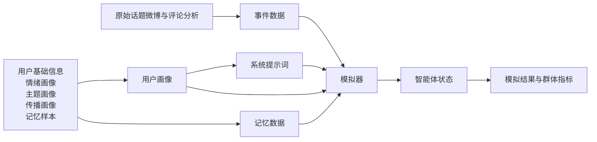
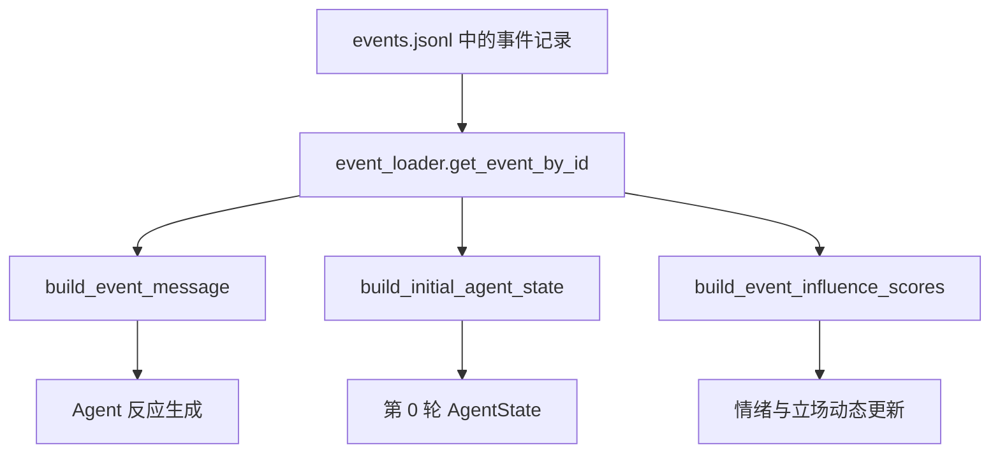
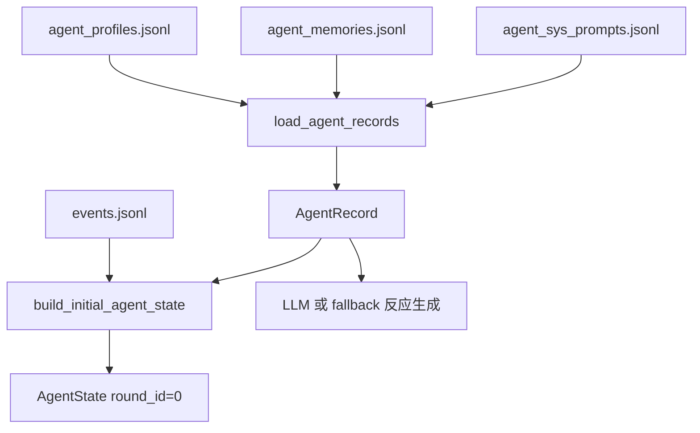
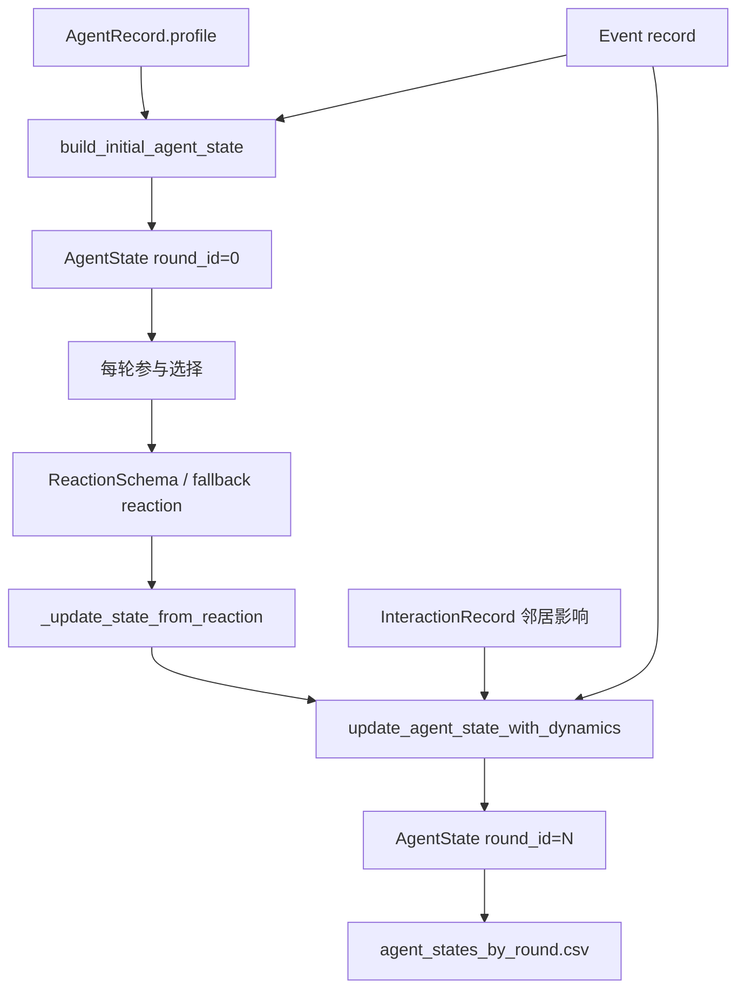
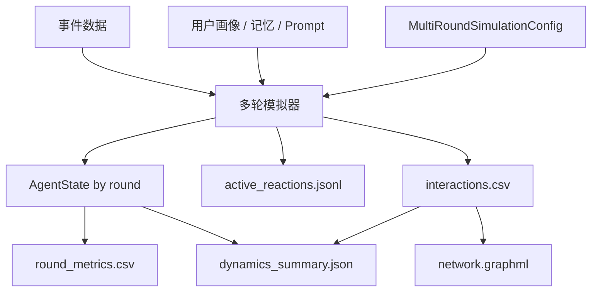

# 项目关键数据结构说明

本文面向 `scope/` 下的模拟输入、运行状态与结果输出，整理项目中最核心的四类数据结构：

- 事件数据结构
- 用户画像数据结构
- 智能体状态数据结构
- 模拟结果数据结构

这些结构共同构成“事件输入 -> 用户 Agent 构建 -> 多轮状态更新 -> 结果分析与可视化”的主链路。

## 事件数据结构

### 设计目的与作用

事件数据结构用于描述一次微博热点事件及其评论区背景，是单事件模拟和多轮模拟的事件输入。当前标准输入文件为 [`scope/data/inputs/events.jsonl`](../scope/data/inputs/events.jsonl)，由 [`scripts/agent_data_preparation/event_builder.py`](../scripts/agent_data_preparation/event_builder.py) 根据话题微博数据和评论分析结果构建，并由 [`scope/src/simulation/event_loader.py`](../scope/src/simulation/event_loader.py) 加载。

在模拟过程中，事件数据主要服务于三类模块：

- Prompt 构造：向 Agent 提供话题、事件背景、情绪倾向和立场焦点。
- 初始状态生成：为 Agent 初始立场提供弱事件倾向。
- 情绪动态更新：把事件主导情绪和主导立场转化为事件刺激分数。

### 字段定义表

下表只保留后续模拟中会被读取、会进入 Prompt、会参与状态初始化/动态更新，或承担标识与回溯作用的字段。事件构建阶段保留但后续未消费的中间字段不列入核心字段表。

| 字段名 | 数据类型 | 含义 | 说明 |
| --- | --- | --- | --- |
| `event_id` | `str` | 事件唯一标识 | 由微博 ID 派生。 |
| `weibo_id` | `str` | 原始话题微博 ID | 用于回溯原始微博和评论分析结果。 |
| `topic` | `str` | 话题文本 | 用作事件标题，也是 Prompt 和输出指标中的可读话题名。 |
| `event_context` | `str` | 事件背景摘要 | 来自微博摘要，是 Agent 理解事件的主要上下文。 |
| `event_type` | `str` | 事件类型 | 影响参与概率和初始立场估计。 |
| `event_emotion_tendency` | `str` | 评论区总体情绪倾向 | 可取 `negative`、`positive`、`mixed`、`neutral`、`unclear` 等。 |
| `event_emotion_summary` | `str` | 情绪摘要文本 | 面向 Prompt 的自然语言总结，描述评论区情绪方向和强度。 |
| `event_stance_focus` | `str` | 典型立场焦点 | 描述评论区围绕什么对象或行为展开支持、反对、质疑等评价。 |
| `dominant_emotion_label` | `str` | 主导细粒度情绪 | 如 `anger`、`disgust`、`sadness`、`joy`、`sympathy` 等。 |
| `dominant_stance_label` | `str` | 主导立场标签 | 如 `favor`、`against`、`neutral`、`mixed`、`unclear`。 |
| `dominant_stance_target_text` | `str` | 主导立场对象文本 | 单事件 Prompt 会展示为“主要评价对象”。 |
| `dominant_norm_violation` | `str` | 规范违背强度 | 多轮 fallback 反应会在负向情绪映射时读取，高规范违背时更容易映射为 `disgust`。 |
| `emotion_distribution` | `dict[str, float]` | 评论情绪组分布 | 包括 `negative`、`positive`、`neutral`、`mixed`、`unclear`。 |
| `stance_distribution` | `dict[str, float]` | 评论立场分布 | 包括 `favor`、`against`、`neutral`、`mixed`、`unclear`。 |

### 与其他数据结构的关系

事件数据是模拟链路的外部刺激源。它不会在模拟过程中被改写，而是被读取后转化为 Prompt 文本、初始状态参数和动态更新参数。

## 用户画像数据结构

### 设计目的与作用

用户画像数据结构用于把微博用户的基础属性、长期情绪、主题兴趣、传播习惯和代表性记忆压缩为 Agent 可用的建模输入。当前标准文件包括：

- [`scope/data/inputs/agent_profiles.jsonl`](../scope/data/inputs/agent_profiles.jsonl)：结构化用户画像。
- [`scope/data/inputs/agent_memories.jsonl`](../scope/data/inputs/agent_memories.jsonl)：代表性历史记忆片段。
- [`scope/data/inputs/agent_sys_prompts.jsonl`](../scope/data/inputs/agent_sys_prompts.jsonl)：用于 Agent Prompt 的压缩画像文本。

其中 `agent_profiles.jsonl` 由 [`scripts/agent_data_preparation/profile_builder.py`](../scripts/agent_data_preparation/profile_builder.py) 合并多类画像表生成，`agent_memories.jsonl` 由 [`scripts/agent_data_preparation/memory_builder.py`](../scripts/agent_data_preparation/memory_builder.py) 生成，`agent_sys_prompts.jsonl` 由 [`scripts/agent_data_preparation/prompt_renderer.py`](../scripts/agent_data_preparation/prompt_renderer.py) 渲染。模拟器通过 [`scope/src/simulation/agent_loader.py`](../scope/src/simulation/agent_loader.py) 按 `agent_id` 合并三者为 `AgentRecord`。

### 字段定义表

下表只保留后续加载、过滤、Prompt 渲染、参与决策、状态初始化、互动权重或结果分组会直接使用的字段。诸如昵称、性别、建模价值标签、入选记忆统计等字段虽然存储在 `agent_profiles.jsonl` 中，但当前模拟链路没有直接读取，因此不作为核心字段列出。

| 字段名 | 数据类型 | 含义 | 说明 |
| --- | --- | --- | --- |
| `agent_id` | `str` | Agent 唯一标识 | 画像、记忆、Prompt 和结果的连接键。 |
| `user_id` | `str` | 微博用户 ID | 用于回溯原始用户。 |
| `verified_type_name` | `str` | 认证类型名称 | 如普通用户、个人认证、媒体/机构类认证等。 |
| `user_level` | `str` | 用户角色层级 | 如 `core`、`normal`、`background`，影响抽样和活跃度估计。 |
| `influence_level` | `str` | 影响力等级 | 与数值型 `influence_score` 互补。 |
| `propagation_role` | `str` | 传播角色 | 如转发扩散者、潜在影响者、低活跃观察者等。 |
| `identity_summary` | `str` | 身份压缩文本 | 供系统 Prompt 使用，概括认证、粉丝、活跃度和传播角色。 |
| `emotion_summary` | `str` | 长期情绪画像文本 | 供 Agent 生成反应时参考。 |
| `topic_summary` | `str` | 主题画像文本 | 概括长期关注主题和公共议题兴趣。 |
| `propagation_summary` | `str` | 传播画像文本 | 概括原创/转发倾向、信息源偏好和影响力。 |
| `pos_ratio` | `float` | 长期正向情绪比例 | 用于初始化情绪分数。 |
| `neg_ratio` | `float` | 长期负向情绪比例 | 用于初始化情绪分数。 |
| `public_issue_topic_ratio` | `float` | 公共议题主题比例 | 公共事件中影响参与概率和初始立场强度。 |
| `repost_ratio` | `float` | 转发倾向 | 用于估计 `repost_tendency_score`。 |
| `repost_with_comment_ratio` | `float` | 带评转发比例 | 单事件参与倾向估计会读取该字段。 |
| `media_dependency_score` | `float` | 媒体依赖度 | 影响对媒体/机构来源评论的敏感度。 |
| `kol_sensitivity_score` | `float` | KOL 敏感度 | 影响互动上下文选择和易感性估计。 |
| `influence_score` | `float` | 数值影响力 | 用于 KOL 选择、互动权重和群体指标。 |
| `memories[].mark` | `str` | 记忆类别标记 | 如 `general_memory`、`style_memory`、`public_issue_memory`、`propagation_memory`。 |
| `memories[].content` | `str` | 记忆文本 | 历史微博样本的压缩内容，进入 Agent 记忆上下文。 |
| `sys_prompt` | `str` | Agent 系统提示词 | 由 `prompt_profile` 渲染得到，指导 Agent 如何扮演该用户。 |

### 与其他数据结构的关系

用户画像是 Agent 的长期属性来源。模拟器先按 `agent_id` 合并画像、记忆和系统提示词，得到 `AgentRecord`；随后 `AgentRecord` 与事件数据共同生成第 0 轮 `AgentState`。

## 智能体状态数据结构

### 设计目的与作用

智能体状态数据结构 `AgentState` 定义在 [`scope/src/simulation/agent_state.py`](../scope/src/simulation/agent_state.py)，表示某个 Agent 在某一轮模拟中的状态快照。它是多轮模拟的核心中间状态，也是 `agent_initial_states.csv` 和 `agent_states_by_round.csv` 的主要字段来源。

该结构的作用是把“长期画像”转化为“当前可更新状态”：

- 第 0 轮：由用户画像和事件倾向初始化。
- 第 1 到 N 轮：根据是否参与、本轮发言、邻居影响、事件刺激和自身表达更新。
- 输出阶段：按轮保存，用于分析群体情绪、立场、极化程度和互动影响。

### 字段定义表

下表保留会进入下一轮决策、互动计算、动态更新、群体指标，或承担运行/事件/Agent 标识作用的字段。`AgentState` 中仍会落盘一些解释性或审计字段，例如更新时间、更新原因、来源等；这些字段目前主要用于人工检查，不参与后续建模或指标计算，因此不列入核心字段表。

| 字段名 | 数据类型 | 含义 | 说明 |
| --- | --- | --- | --- |
| `run_id` | `str` | 本次模拟运行 ID | 连接一次运行下的配置、状态、反应和统计结果。 |
| `event_id` | `str` | 当前事件 ID | 来自事件数据结构。 |
| `weibo_id` | `str or None` | 原始微博 ID | 用于事件回溯。 |
| `topic` | `str or None` | 话题文本 | 用于输出和可视化展示。 |
| `agent_id` | `str` | Agent ID | 与用户画像、记忆、Prompt 和反应结果关联。 |
| `user_id` | `str or None` | 用户 ID | 原始微博用户标识。 |
| `round_id` | `int` | 轮次编号 | `0` 为初始状态，`1..N` 为模拟轮次。 |
| `memory_user_level` | `str or None` | 记忆用户层级 | 来自画像，用于抽样、活跃度和分层分析。 |
| `verified_type_name` | `str or None` | 认证类型 | 用于识别媒体、机构或普通用户影响。 |
| `propagation_role` | `str or None` | 传播角色 | 用于 KOL 选择、活跃度估计和可解释输出。 |
| `influence_level` | `str or None` | 影响力等级 | 离散影响力描述。 |
| `influence_score` | `float` | 影响力分数 | 范围 `[0, 1]`，影响互动和 KOL 选择。 |
| `susceptibility_score` | `float` | 易感性分数 | 范围 `[0, 1]`，由 KOL 敏感度和媒体依赖度估计。 |
| `activity_score` | `float` | 活跃度分数 | 范围 `[0, 1]`，影响每轮参与概率。 |
| `kol_sensitivity_score` | `float` | KOL 敏感度 | 来自用户画像，影响上下文评论选择。 |
| `media_dependency_score` | `float` | 媒体依赖度 | 来自用户画像，影响对媒体/机构来源的敏感度。 |
| `repost_tendency_score` | `float` | 转发倾向分数 | 通常由 `repost_ratio` 映射。 |
| `emotion_score` | `float` | 当前情绪分数 | 范围 `[-1, 1]`；正值偏正向，负值偏负向。 |
| `emotion_label` | `str` | 当前情绪状态标签 | 由 `emotion_score` 映射为 `positive`、`neutral`、`negative`。 |
| `stance_score` | `float` | 当前立场分数 | 范围 `[-1, 1]`；正值偏支持，负值偏反对。 |
| `stance_label` | `str` | 当前立场状态标签 | 由 `stance_score` 映射为 `support`、`neutral`、`against`。 |
| `is_active` | `bool` | 本轮是否参与 | 控制是否产生可见反应。 |
| `last_action_type` | `str` | 上一轮可见行为 | 如 `ignore`、`comment`、`repost`、`repost_with_comment`。 |
| `last_reaction_text` | `str` | 上一轮发言文本 | 用于下一轮 LLM Prompt 中提示该 Agent 的上一轮表达。 |
| `emotion_delta` | `float or None` | 情绪变化量 | 当前轮情绪分数相对上一轮的变化，用于群体波动指标。 |
| `stance_delta` | `float or None` | 立场变化量 | 当前轮立场分数相对上一轮的变化，用于群体波动指标。 |
| `neighbor_emotion_score` | `float or None` | 邻居加权情绪分数 | 来自本轮互动边聚合。 |
| `neighbor_stance_score` | `float or None` | 邻居加权立场分数 | 来自本轮互动边聚合。 |
| `neighbor_influence_weight_sum` | `float or None` | 邻居影响权重和 | 反映上下文影响强度。 |
| `neighbor_count` | `int or None` | 邻居数量 | 本轮对该 Agent 产生候选影响的来源数。 |
| `event_emotion_score` | `float or None` | 事件情绪刺激分数 | 由事件主导情绪转化。 |
| `event_stance_score` | `float or None` | 事件立场刺激分数 | 由事件主导立场或焦点转化。 |
| `own_reaction_emotion_score` | `float or None` | 自身表达情绪分数 | 由本轮反应的情绪标签和强度转化。 |
| `own_reaction_stance_score` | `float or None` | 自身表达立场分数 | 由本轮反应的立场标签和强度转化。 |
| `dynamics_enabled` | `bool` | 是否应用动态更新 | 用于区分普通状态更新和情绪动态模型更新。 |

### 与其他数据结构的关系

`AgentState` 是用户画像和模拟结果之间的桥梁。它既读取画像中的长期参数，也记录每轮模拟后可分析的短期状态。

## 模拟结果数据结构

### 设计目的与作用

模拟结果数据结构用于记录一次模拟运行的配置、事件快照、每轮 Agent 状态、每条可见反应、互动边和群体统计指标。多轮模拟默认输出到：

[`scope/data/outputs/simulation/multiround/{run_id}`](../scope/data/outputs/simulation/multiround/)

主要由 [`scope/src/simulation/multiround_simulator.py`](../scope/src/simulation/multiround_simulator.py)、[`scope/src/simulation/multiround_analyzer.py`](../scope/src/simulation/multiround_analyzer.py)、[`scope/src/simulation/interaction_schema.py`](../scope/src/simulation/interaction_schema.py) 写入。

典型输出文件包括：

| 文件名 | 数据结构 | 作用 |
| --- | --- | --- |
| `config.json` | 运行配置 | 保存 `run_id`、事件 ID、轮数、互动/动态开关和参数。 |
| `selected_event.json` | 事件快照 | 保存本次运行使用的事件数据，便于结果复现。 |
| `agent_initial_states.csv` | 初始状态表 | 保存第 0 轮 Agent 状态。 |
| `agent_states_by_round.csv` | 全轮状态表 | 保存第 0 到第 N 轮每个 Agent 的状态快照。 |
| `active_reactions.jsonl` | 可见反应记录 | 保存每轮实际参与 Agent 的行为、文本、情绪和立场。 |
| `round_metrics.csv` | 群体统计指标 | 保存每轮参与率、情绪分布、立场分布、波动和极化指标。 |
| `interactions.csv` | 互动边记录 | 启用互动时保存 `source_agent -> target_agent` 候选影响边。 |
| `network.graphml` | 互动网络图 | 启用互动时保存可视化网络结构。 |
| `dynamics_summary.json` | 动态汇总 | 保存初末状态变化、最终分布、总互动数和动态参数。 |

### 字段定义表

#### 反应记录：`active_reactions.jsonl`

当前代码中可见行为字段命名为 `action_type`，可见回复文本命名为 `reaction_text`；它们分别对应一般结果描述中的 `action` 和 `response_text`。影响来源不单独写成一个 `influence_source` 字段，而是通过 `context_agent_ids`、`influenced_by_high_influence` 以及 `interactions.csv` 中的 `source_agent_id -> target_agent_id` 边来表达。

| 字段名 | 数据类型 | 含义 | 说明 |
| --- | --- | --- | --- |
| `run_id` | `str` | 运行 ID | 与本次输出目录对应。 |
| `event_id` | `str` | 事件 ID | 与 `selected_event.json` 对应。 |
| `round_id` | `int` | 轮次编号 | 仅记录第 1 到 N 轮实际反应。 |
| `agent_id` | `str` | 发言 Agent ID | 连接画像和状态表。 |
| `user_id` | `str or None` | 用户 ID | 原始微博用户标识。 |
| `memory_user_level` | `str or None` | 用户层级 | 便于分层分析。 |
| `propagation_role` | `str or None` | 传播角色 | 解释发言者身份。 |
| `influence_score` | `float` | 影响力分数 | 用于分析高影响力发言。 |
| `activity_score` | `float` | 活跃度分数 | 用于解释参与选择。 |
| `participate` | `bool` | 是否参与 | 一般为 `true`，若不参与则行为为 `ignore`。 |
| `action_type` | `str` | 行为类型 | `ignore`、`comment`、`repost`、`repost_with_comment`。 |
| `emotion_label` | `str` | 反应情绪标签 | 与 `ReactionSchema` 对齐，如 `anger`、`disgust`、`joy`、`mixed`。 |
| `emotion_intensity` | `int` | 反应情绪强度 | 取值 `0`、`1`、`2`。 |
| `stance_label` | `str` | 反应立场标签 | 如 `favor`、`against`、`neutral`、`mixed`、`unclear`。 |
| `stance_intensity` | `int` | 反应立场强度 | 取值 `0`、`1`、`2`。 |
| `reaction_text` | `str` | 可见微博式反应文本 | 进入上下文评论池和可视化。 |
| `source` | `str` | 反应来源 | 如 `fallback_rule` 或 LLM 相关来源。 |
| `llm_attempted` | `bool` | 是否尝试调用 LLM | 用于区分规则 fallback 和模型调用路径。 |
| `parse_status` | `str` | 解析状态 | 如 `success`、`parse_failed`。 |
| `speaker_type` | `str` | 发言者类型 | 如 `kol_speaker`、`regular_agent`。 |
| `context_agent_ids` | `str` | 上下文来源 Agent 列表 | 以逗号拼接，表示本反应参考过哪些评论。 |
| `context_comment_count` | `int` | 上下文评论数 | 普通 Agent 读取的可见评论数量。 |
| `influenced_by_high_influence` | `bool` | 是否受高影响力评论影响 | 根据上下文来源影响力判断。 |

#### 群体指标：`round_metrics.csv`

| 字段名 | 数据类型 | 含义 | 说明 |
| --- | --- | --- | --- |
| `run_id` | `str` | 运行 ID | 与输出目录对应。 |
| `event_id` | `str` | 事件 ID | 当前模拟事件。 |
| `topic` | `str` | 话题文本 | 便于结果阅读。 |
| `round_id` | `int` | 轮次编号 | 从 `0` 到 `N`。 |
| `total_agents` | `int` | Agent 总数 | 本轮状态快照中的 Agent 数量。 |
| `active_agent_count` | `int` | 活跃 Agent 数 | 本轮参与讨论的 Agent 数。 |
| `participation_rate` | `float` | 参与率 | `active_agent_count / total_agents`。 |
| `avg_emotion_score` | `float` | 平均情绪分数 | 群体情绪状态均值。 |
| `avg_stance_score` | `float` | 平均立场分数 | 群体立场状态均值。 |
| `positive_count` / `neutral_emotion_count` / `negative_count` | `int` | 情绪状态计数 | 基于 `AgentState.emotion_label` 统计。 |
| `positive_ratio` / `neutral_ratio` / `negative_ratio` | `float` | 情绪状态比例 | 群体情绪分布。 |
| `support_count` / `neutral_stance_count` / `oppose_count` | `int` | 立场状态计数 | 基于 `AgentState.stance_label` 统计。 |
| `support_ratio` / `neutral_stance_ratio` / `oppose_ratio` | `float` | 立场状态比例 | 群体立场分布。 |
| `avg_influence_score_active` | `float` | 活跃者平均影响力 | 反映本轮参与者是否偏高影响力。 |
| `avg_activity_score_active` | `float` | 活跃者平均活跃度 | 反映本轮参与者活跃程度。 |
| `kol_speaker_count` | `int` | KOL 发声者数量 | 互动模式下的高影响力发声者数。 |
| `regular_active_count` | `int` | 普通活跃者数量 | 互动模式下普通参与者数。 |
| `interaction_count` | `int` | 本轮互动边数量 | 表示可见评论形成的候选影响边。 |
| `avg_interaction_weight` | `float` | 平均互动权重 | 本轮影响边权重均值。 |
| `agents_with_context_count` | `int` | 读取上下文的 Agent 数 | 普通 Agent 中参考评论上下文者数量。 |
| `avg_context_comment_count` | `float` | 平均上下文评论数 | 反映每个普通 Agent 看到的评论规模。 |
| `emotion_volatility` | `float` | 情绪波动度 | 本轮情绪分数标准差。 |
| `stance_volatility` | `float` | 立场波动度 | 本轮立场分数标准差。 |
| `avg_abs_emotion_delta` | `float` | 平均绝对情绪变化 | 衡量本轮情绪演化幅度。 |
| `avg_abs_stance_delta` | `float` | 平均绝对立场变化 | 衡量本轮立场演化幅度。 |
| `dominant_emotion_state` | `str` | 主导情绪状态 | 由 `positive`、`neutral`、`negative` 计数得到。 |
| `dominant_stance_state` | `str` | 主导立场状态 | 由 `support`、`neutral`、`against` 计数得到。 |
| `polarization_score` | `float` | 极化分数 | 当前实现使用立场分数标准差表示。 |
| `avg_neighbor_count` | `float` | 平均邻居数 | 动态更新时每个 Agent 的平均影响来源数。 |
| `agents_affected_by_neighbors` | `int` | 受邻居影响的 Agent 数 | `neighbor_count > 0` 的 Agent 数。 |
| `avg_neighbor_influence_weight` | `float` | 平均邻居影响权重 | 反映社会影响强度。 |
| `dynamics_enabled` | `bool` | 是否启用动态更新 | 若任一状态应用动态模型则为真。 |

#### 互动边：`interactions.csv`

| 字段名 | 数据类型 | 含义 | 说明 |
| --- | --- | --- | --- |
| `source_agent_id` | `str` | 影响来源 Agent | 已发声、被目标 Agent 看到的评论来源。 |
| `target_agent_id` | `str` | 影响目标 Agent | 读取上下文并可能受影响的 Agent。 |
| `round_id` | `int` | 轮次编号 | 互动边所属轮次。 |
| `interaction_type` | `str` | 互动类型 | 当前主要表示候选影响关系。 |
| `weight` | `float` | 互动权重 | 范围 `[0.01, 1.0]`，用于邻居情绪/立场加权。 |
| `source_action_type` | `str` | 来源行为类型 | 来源 Agent 的评论或转发行为。 |
| `source_reaction_text` | `str` | 来源评论文本 | 会被截断为较短文本。 |
| `target_action_type` | `str or None` | 目标行为类型 | 目标 Agent 后续产生的行为。 |
| `target_reaction_text` | `str or None` | 目标反应文本 | 用于解释互动后的表达。 |
| `context_rank` | `int or None` | 上下文排序 | 表示该来源评论在目标可见上下文中的排名。 |
| `source_emotion_score` | `float` | 来源情绪分数 | 用于聚合邻居情绪影响。 |
| `target_emotion_score_before` | `float` | 目标更新前情绪 | 用于分析影响前后变化。 |
| `target_emotion_score_after` | `float or None` | 目标更新后情绪 | 动态更新后写入。 |
| `source_stance_score` | `float` | 来源立场分数 | 用于聚合邻居立场影响。 |
| `target_stance_score_before` | `float` | 目标更新前立场 | 用于分析影响前后变化。 |
| `target_stance_score_after` | `float or None` | 目标更新后立场 | 动态更新后写入。 |
| `source_influence_score` | `float` | 来源影响力 | 影响边权重和高影响力统计。 |
| `target_susceptibility_score` | `float` | 目标易感性 | 调节社会影响强度。 |
| `source_verified_type_name` | `str or None` | 来源认证类型 | 用于解释媒体/机构影响。 |
| `source_propagation_role` | `str or None` | 来源传播角色 | 用于解释 KOL 或传播角色影响。 |

#### 动态汇总：`dynamics_summary.json`

| 字段名 | 数据类型 | 含义 | 说明 |
| --- | --- | --- | --- |
| `run_id` | `str` | 运行 ID | 与输出目录对应。 |
| `event_id` | `str` | 事件 ID | 当前模拟事件。 |
| `topic` | `str` | 话题文本 | 便于阅读。 |
| `dynamics_enabled` | `bool` | 是否启用情绪动态 | 对应运行配置。 |
| `interaction_enabled` | `bool` | 是否启用互动 | 对应运行配置。 |
| `total_agents` | `int` | Agent 总数 | 本次运行参与建模的 Agent 数。 |
| `rounds` | `int` | 模拟轮数 | 不含第 0 轮初始化。 |
| `initial_avg_emotion_score` | `float` | 初始平均情绪 | 第 0 轮群体情绪均值。 |
| `final_avg_emotion_score` | `float` | 最终平均情绪 | 最后一轮群体情绪均值。 |
| `emotion_score_change` | `float` | 情绪均值变化 | `final - initial`。 |
| `initial_avg_stance_score` | `float` | 初始平均立场 | 第 0 轮群体立场均值。 |
| `final_avg_stance_score` | `float` | 最终平均立场 | 最后一轮群体立场均值。 |
| `stance_score_change` | `float` | 立场均值变化 | `final - initial`。 |
| `final_emotion_distribution` | `dict[str, int]` | 最终情绪状态分布 | 基于最后一轮 `emotion_label`。 |
| `final_stance_distribution` | `dict[str, int]` | 最终立场状态分布 | 基于最后一轮 `stance_label`。 |
| `max_emotion_volatility` | `float` | 最大情绪波动 | 各轮 `emotion_volatility` 最大值。 |
| `max_stance_volatility` | `float` | 最大立场波动 | 各轮 `stance_volatility` 最大值。 |
| `final_polarization_score` | `float` | 最终极化分数 | 最后一轮立场波动度。 |
| `total_interaction_count` | `int` | 总互动边数 | 所有轮次互动边数量。 |
| `agents_ever_affected_by_neighbors` | `int` | 曾受邻居影响的 Agent 数 | 出现在互动边目标端的 Agent 数。 |
| `parameter_config` | `dict` | 动态参数快照 | 保存情绪/立场保留、社会影响、事件影响、自身表达影响等权重。 |

### 与其他数据结构的关系

模拟结果是事件数据、用户画像和智能体状态共同作用后的落盘结果。`active_reactions.jsonl` 记录“谁说了什么”，`agent_states_by_round.csv` 记录“说完之后状态如何”，`round_metrics.csv` 和 `dynamics_summary.json` 记录“群体层面发生了什么”。

## 小结

四类数据结构之间的核心关系可以概括为：

1. 事件数据提供外部事件刺激和评论区总体语境。
2. 用户画像提供 Agent 的长期身份、情绪、主题、传播和记忆特征。
3. 智能体状态把长期画像转化为每轮可更新的情绪、立场和行为状态。
4. 模拟结果把每轮反应、状态变化、互动边和群体指标保存为可分析、可复现的文件。

因此，项目中的关键数据结构不是孤立文件，而是一条连续的数据链路：上游数据准备脚本把原始微博数据压缩为事件和用户画像，模拟器把它们转化为多轮 Agent 状态，分析与可视化模块再读取结果文件解释群体情绪和立场演化。
